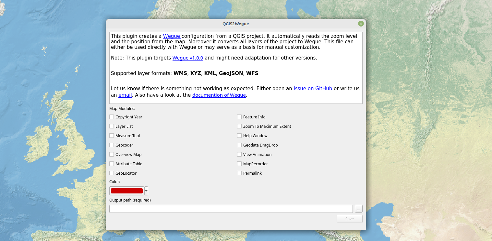

# QGIS2Wegue

A QGIS plugin for creating [Wegue](https://github.com/meggsimum/wegue) configurations based on a QGIS project. Supported formats are: `WMS`, `XYZ`, `KML`, `GeoJSON`, `WFS`



## Usage

- Add all your desired layers to QGIS
- Open the plugin, chose a filepath and click `OK`
- Now you have a configuration file that works with Wegue

## Installation

QGIS2Wegue is available in the offical [QGIS plugin repository](https://plugins.qgis.org/plugins/qgis2wegue/). Download via `Plugins` --> `Manage and Install Plugins ...`.

## Setup for Developers

The setup works basically same for Windows, Linux and Mac:

1. Enter your QGIS plugin directory with `cd PATH/TO/YOUR/QGIS/PLUGIN/DIRECTORY` The path depends on your QGIS installation. Typical locations are:
    - Windows (standalone installation): `C:\Users\USER\AppData\Roaming\QGIS\QGIS3\profiles\default\python\plugins`
    - Windows (Network Installation): `C:\OSGeo4W64\apps\qgis\python\plugins`
    - Ubuntu/Debian: `~/.local/share/QGIS/QGIS3/profiles/default/python/plugins`

2. Download QGIS2Wegue: `git clone https://github.com/meggsimum/qgis2wegue`

3. Restart QGIS

4. Open the plugin manager and activate the plugin - the plugin should show up in the toolbar

Update the plugin with `git pull https://github.com/meggsimum/qgis2wegue` and restart QGIS

[assets/demo_project.qgs](assets/demo_project.qgs) is a sample QGIS project which is useful for testing.

## Development Snippets

Install `pyqt5-dev-tools`. On Debian/Ubuntu:

```shell
sudo apt-get install pyqt5-dev-tools
```

Check code quality and errors:

```shell
# installation if needed
pip install --user pylint pycodestyle

pylint --reports=n --rcfile=pylintrc .
pycodestyle --repeat --ignore=W504,E203,E121,E122,E123,E124,E125,E126,E127,E128 --exclude=resources.py .
```

Compile resources e.g. when logo has changed:

```shell
pyrcc5 -o resources.py resources.qrc
```

Copy relevant files for a release:

```shell
# edit this path
TARGET_DIR=your/custom/path

TMP_PLUGIN_DIR=${TARGET_DIR}/qgis2wegue

mkdir ${TMP_PLUGIN_DIR}
cp -r \
  *.py \
  *ui \
  logo \
  README.md \
  resources.qrc \
  metadata.txt \
  ${TMP_PLUGIN_DIR}
```

## Release

- set new version in `metadata.txt`
- set new version as tag in git
- make GitHub release and add zipped plugin
- publish plugin on QGIS plugin repository

